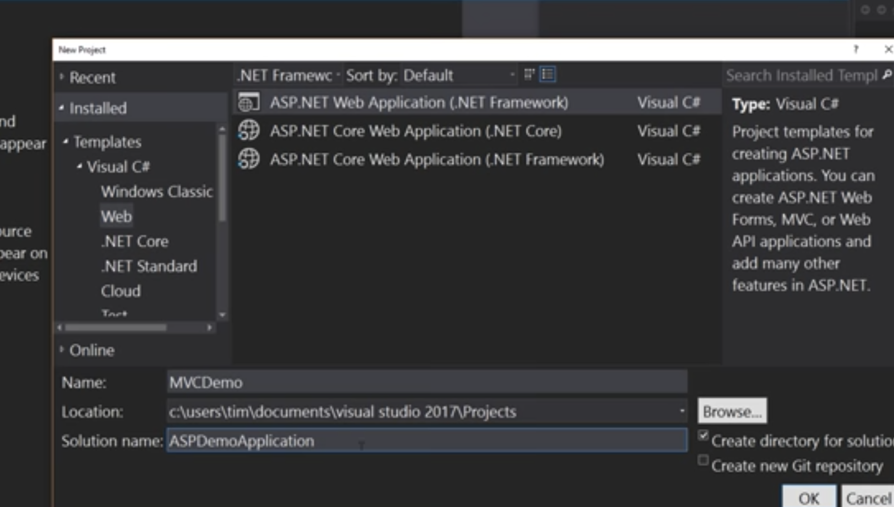

# WEB APP ASP.NET MVC 


## NOTES 

Big difference between selecting ASP .NET Framework web and ASP .NET Core web.  
Core gives you the ability to render based on Development or production! More [here]()   
Controller -> Model(Classes) -> views (html/css), Internet information server. For hosting.  
Hosted on IS express or slim down version on your machine.  
HTML can be changed dynamically.  
  
## ASP & MVC

  
- **ASP** is the umbrella in which microsoft puts in all of their web focused tools and applications. Used to stand for `active server pages` which was web forms (the old microsoft forms). 
- **MVC** is one of the things under the umbrella, it stands for `model view controller`. 
- MVC is a UI user centric patter, it doesn't cover business logic or data access or anything behind the scenes. 
- The MVC can easily plumb in existing backend logic from other console/dekstop applications. 
- So in many cases we can just change the user interface rather than the application. 

C# sharp is the code that sits in the backend, the user only sees HTML, CSS and javascript as usual.   

### CONTROLLER   

MVC uses `naming convetions` to link things up.    
This is the core MVC is the controllers, this is the backbone of MVC.    
The controllers `like the views with the data`, it is controlling the application.   
When we create our first application, there will be a controler folder with one controller `HomeController`, that is bare bones just a few methods as a sample.   
```
        public IActionResult Index()
        {
            return View();
        }

```
In this case, the view is stored in the `view` folder in the `home` sub folder and finally there will be the `index` view.   
In this case it's just the `index.cshtml` page.  
Some other visual studios SDKs will give an about page with about controller, view and page.  

### VIEW 
  
View is the html files and other bits needed in the `view` folder.    
Notice in our html pages, there is no `<html>` tags, this is because the view is just a part of the page. 

**Layout template** 

You can find other parts in `view` `shared` `_layout.cshtml`.    
This is much bigger html, but inside the body is the following code with an `@RenderBody()` method pulls in the relevant html file and embeds it. 
```
    <div class="container">
        <main role="main" class="pb-3">
            @RenderBody()
        </main>
    </div>
```
Note that navigation part of the HTML and footer part, never changes. It's only the body, which we are dynamically loading up parts from the view html pages.    
So each view just injects itself via the `@RenderBody()` method into the whole.   

`javascript` is in the `wwwroot/lib` folder   
  

### Razor Syntax
  
Microsoft creation which allows us to mix C# and HTML.  
Inside the HTML the `@` symbol pulls in C# code but the engine is smart enough to know when the C# ends.  i.e. 

**Simple example**  
  
This will plant the date time in here. 
```
<p>&copy; @DateTime.Now.year - My ASP.NET Application </p>

```

**Harder example**  
  
This will plant the url path in here. 
**_Layout.cshtml**
```
<div class='navbar-collapse collapse'>
...blah
<li>@Html.ActionLink("Home", "Index", "Home")</li>
<li>@Html.ActionLink("Home", "About", "Home")</li>

```
  
Normally a link has the full path, so this method will take care of everything such as finding out the path from the home controller index action.   

### CSHARP RAZOR BLOCK  

**NOTE** if the engine gets confused, you can tell it where to end with `{}`.  
Below shows how our `index.cshtml` will pass in the text `home page` into the `_layout.cshtml` full html file, this becomes the index.html.

```

_LAYOUT.CSHTML (FULL HTML)

<title>@ViewBag.Title - My ASP.NET Application </title> 


INDEX.CSHTML 

@{
	ViewBag.Title = "Home Page";
}

```

## MODEL 

Is a class with properties. It could be a block of code that returns data from a database.

Example 
```
using System;

namespace MVCDemo.Models
{
    public class ErrorViewModel
    {
        public string RequestId { get; set; }

        public bool ShowRequestId => !string.IsNullOrEmpty(RequestId);
    }
}

```

Create your own model by going to `add` then `add file` then `empty class` and name it. Make sure you add `model` into the name.  

```
using System;
namespace MVCDemo.Models
{
    public class PersonModel
    {
        public string FirstName { get; set; }
        public string LastName { get; set; }
        public int Age { get; set; } = 0; // normally would use a birthday so we can have it change with date.
        public bool IsAlive { get; set; } = true; //default setting

    }
}

```

## ROUTES  
  
Can be found in the `App_Start` folder.  Which should have `BundleConfig.cs` , `FilterConfig.cs` and `RouteConfig.cs`. 
When using .NET Core this will be different. 
Instead mines is in the `startup.cs` code 

```
            app.UseEndpoints(endpoints =>
            {
                endpoints.MapControllerRoute(
                    name: "default",
                    pattern: "{controller=Home}/{action=Index}/{id?}");
            });

```
Which is very different from the setup in RouteConfig.cs it will specify a default in routes. 

## STARTING UP   

Create a new application, make sure you select the one that says `web application`.  
  

  
   
Chose template as MVC, Web API is super awesome to look into and decouples from front end (focuses on just back end stuff. ).  
Now select no authentication, there is code for auth methods.   
When you select OK, the bottom left will import a bunch of components and download nugget packages.

## Nugget 
  
Microsoft package manager like brew or yum etc. So we can pull in jquery, bootstrap etc.  
Be careful, you may not be able to just install all the latest ones: You will need to look for stable versions and compatability etc. 
**NOTE** best to uncheck 'include prerelease'. 
  

[link]()
